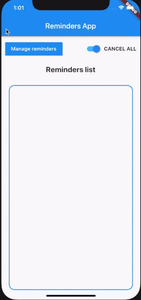

# Flutter Reminders app

A Flutter project which demonstrates using 'redux-persist' and local notifications.

## Show some ❤️ and star the repo to support the project

     

## Getting Started

Tutorial Articles for this repository:

[How to add redux-persist to flutter app?](https://brainsandbeards.com/blog/how-to-add-redux-persist-to-flutter-app)

## References

[https://pub.dev/packages/redux_persist](https://pub.dev/packages/redux_persist)

[https://brainsandbeards.com/blog/ultimate-redux-guide-for-flutter](https://brainsandbeards.com/blog/ultimate-redux-guide-for-flutter)

[https://pub.dev/packages/redux](https://pub.dev/packages/redux)

## Author & support

[Brains and Beards](https://brainsandbeards.com/)